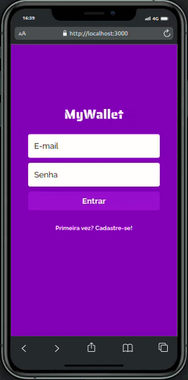

# My Wallet

<p align="center">
   
</p>


- Equilibrar os gastos com as necessidades (e desejos) é uma prática saudável e que ajuda a manter as contas em dia
- O controle financeiro é um exercício diário
- Para isso surgiu o My Wallet, uma aplicação onde você pode administrar melhor suas finanças

- [Veja meu deploy na Vercel aqui](https://projeto13-mywallet-front-seven.vercel.app/)
- [Veja meu repositório back end desta aplicação aqui](https://github.com/marcojr73/--projeto13-mywallet-back-)

***

# Demonstração

<p align="center">
   
</p>

## Como usar

Instale meu projeto e suas dependências

```bash
  git clone git@github.com:marcojr73/projeto13-mywallet-front.git
  
  npm i
  
  npm start
```

***

##	 Tecnologias e Conceitos

- React
- Styled Componentes
- Persistência de login com local storage
- Context API

***
    
